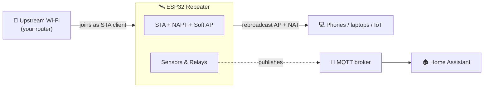
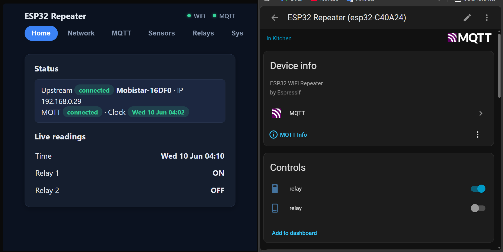
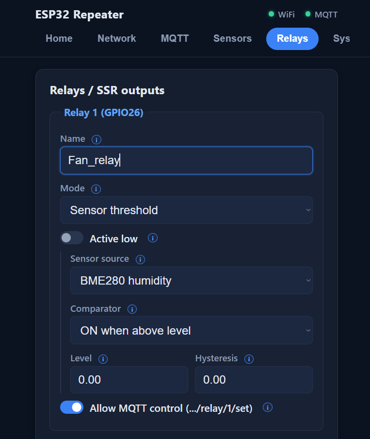
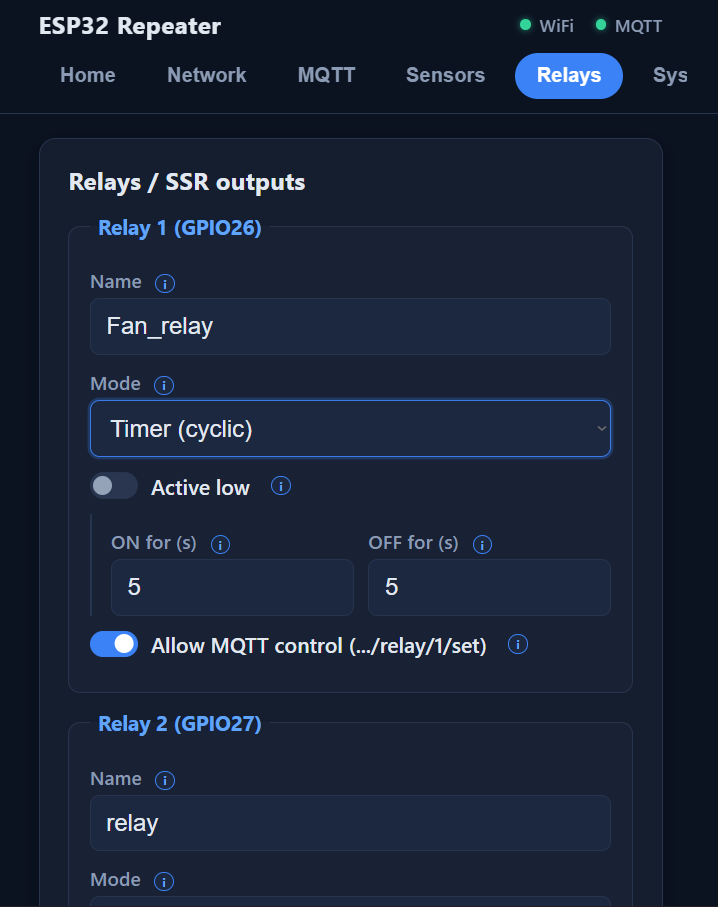
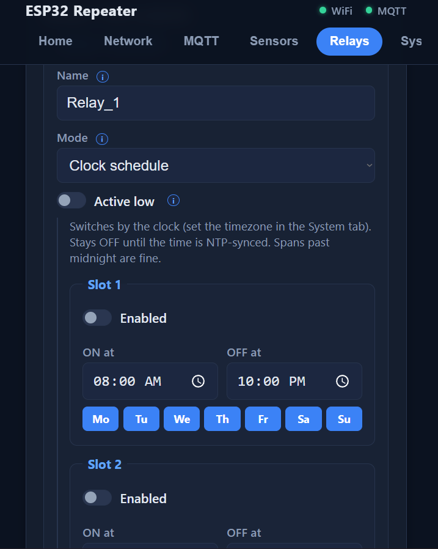
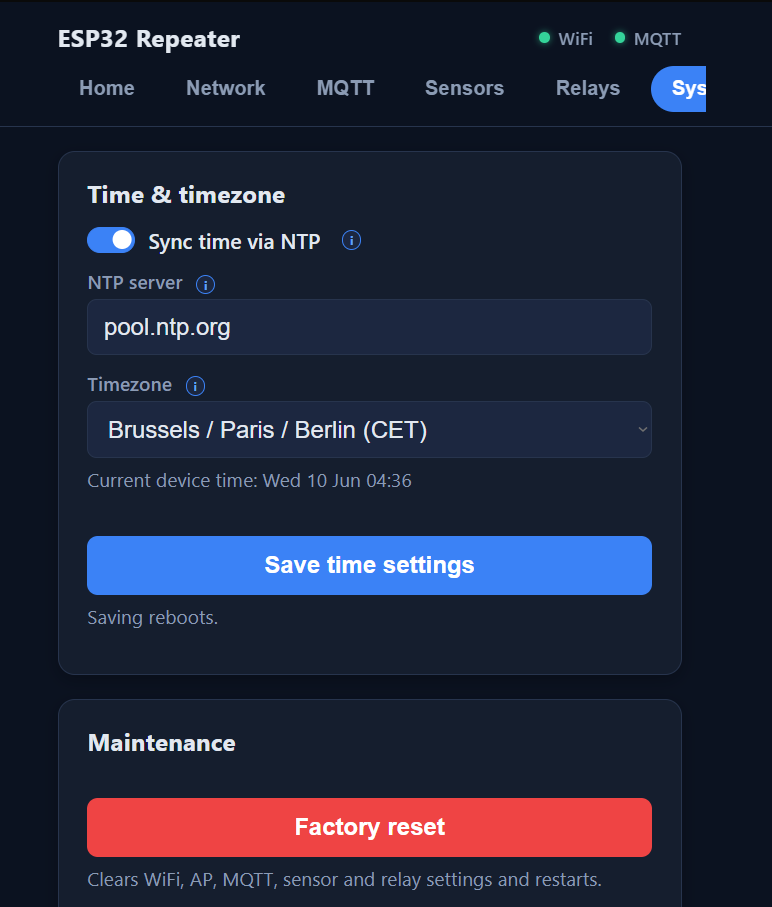
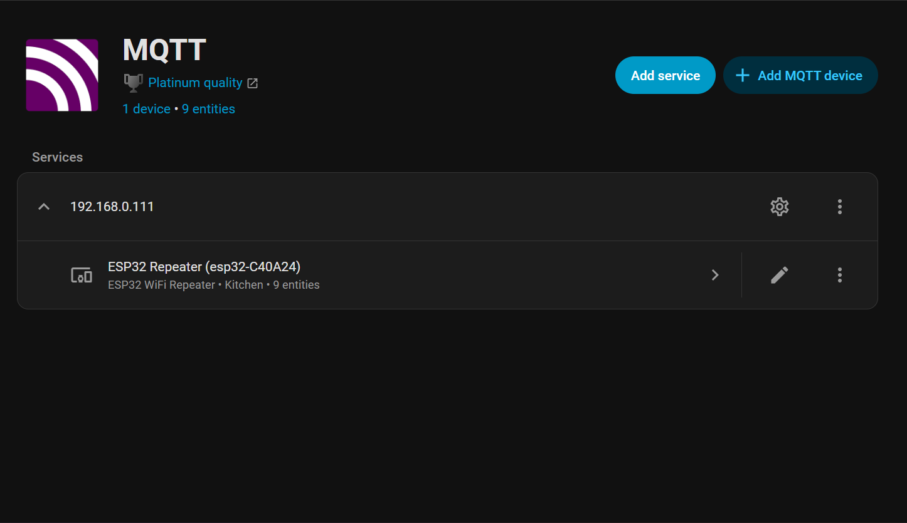
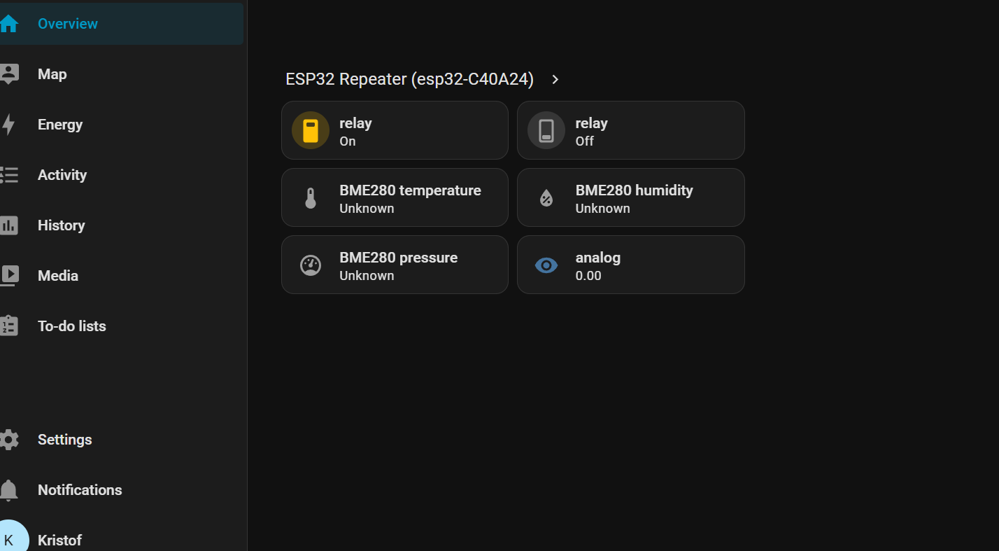

# 📡 ESP32 Wi-Fi Repeater + IoT Node

**Extend your Wi-Fi *and* read sensors, drive relays, and talk to Home Assistant — all configured from a phone, no re-flashing.**

---

A single ESP32 sketch that turns the board into a **true NAT Wi-Fi repeater** (devices on its access point get real internet, not an isolated network) — and, on top of that, a handy little **IoT edge node**. It can read a BME280, a DS18B20, and analog sensors (like an LDR), publish them to **MQTT**, drive **two relay/SSR outputs** from local rules, and **auto-register everything in Home Assistant**. Every setting is entered through a captive-portal web page; nothing is hard-coded.

## ✨ Features

- 📶 **Real repeater** — concurrent AP + STA with NAPT/NAT, so AP clients route out to the internet.
- 🔧 **Zero-flash setup** — pick your network, set passwords, configure everything from a web page. Settings persist in flash.
- 🔒 **Safe by default** — ships as `ESP32-repeaterAP` / `12345678` and nags you (on-page) until you change the default password.
- 🌡️ **Sensors** — BME280 (temp/humidity/pressure), DS18B20 (temp), and 2× analog inputs with raw/percent/voltage scaling and one-click calibration.
- 🚨 **Alerts** — per-reading low/high thresholds published to MQTT.
- 🔌 **Relays** — two outputs driven by timer, sensor threshold (with hysteresis), a push button, clock schedules, or MQTT.
- ⏰ **Clock schedules** — NTP-synced time (timezone + DST aware); each relay can follow up to 4 weekly ON/OFF slots.
- 📨 **MQTT** — periodic publishing with retained Last-Will availability.
- 🏠 **Home Assistant auto-discovery** — sensors, switches, and diagnostics appear automatically, grouped as one device.
- ♻️ **Factory reset** — recover a misconfigured unit from the web page, no cable needed.

## 🗺️ How it fits together

## 📸 What it looks like

Everything is managed from a clean, tabbed web page served by the ESP32 itself. Here's the **Home tab** next to the device as it appears in **Home Assistant** after MQTT auto-discovery — no YAML, it just shows up:

The **Relays tab** in action — every mode is configured in place. Below: a humidity-driven fan on a sensor threshold, a cyclic timer, the clock-schedule mode with weekly slots, and the **System tab** with the time settings that power those schedules:

| Sensor threshold | Cyclic timer |
|:--:|:--:|
|  |  |

| Clock schedule | Time & timezone |
|:--:|:--:|
|  |  |

<b>Table of contents</b>

- [What it looks like](#-what-it-looks-like)
- [Quick Start](#-quick-start)
- [Pin Map & Wiring](#-pin-map--wiring)
- [Web Setup Walkthrough](#-web-setup-walkthrough)
- [Sensors, MQTT & Relays](#-sensors-mqtt--relays)
- [Home Assistant](#-home-assistant)
- [How It Works](#-how-it-works)
- [Troubleshooting](#-troubleshooting)
- [Hardware & Enclosure](#-hardware--enclosure)
- [Contributing](#-contributing)
- [License](#-license)

---

## 🚀 Quick Start

### Prerequisites

1. **Arduino IDE** (1.8.x or 2.x).
2. **ESP32 board package** — in *File → Preferences → Additional Boards Manager URLs* add
   `https://raw.githubusercontent.com/espressif/arduino-esp32/gh-pages/package_esp32_index.json`, then install **esp32 by Espressif Systems** from *Tools → Board → Boards Manager*.
3. **Libraries** — install these from *Sketch → Include Library → Manage Libraries* (the **Library Manager**):

   | Library | Why | Notes |
   |---------|-----|-------|
   | **PubSubClient** | MQTT client | |
   | **Adafruit BME280** | BME280 sensor | |
   | **Adafruit Unified Sensor** | dependency of BME280 | |
   | **OneWire** | DS18B20 bus | |
   | **DallasTemperature** | DS18B20 readings | |
   | **ArduinoJson** | settings persistence | ⚠️ **must be v7** — v6 will not compile |

   *(`WiFi`, `WebServer`, `DNSServer`, `Preferences`, `Wire` ship with the ESP32 core — no install needed.)*

### Install the code

1. **Download** this repo (green **Code → Download ZIP**, or `git clone`) and unzip it.
2. **Place the sketch folder in your Arduino sketchbook.** Arduino requires a `.ino` file to live in a folder of the **same name**, inside your sketchbook directory:
   - **Windows:** `Documents\Arduino\`
   - **macOS:** `~/Documents/Arduino/`
   - **Linux:** `~/Arduino/`

   Copy the **`ESP32-WiFi-Repeater/`** folder (the one containing `ESP32-WiFi-Repeater.ino` plus its `.h`/`.cpp` module tabs and `web_page.h`) there, so you end up with e.g.
   `Documents\Arduino\ESP32-WiFi-Repeater\ESP32-WiFi-Repeater.ino`.

   > 💡 The exact sketchbook path is shown in *Arduino IDE → File → Preferences → "Sketchbook location"*.
3. **Open** `ESP32-WiFi-Repeater.ino` — every module tab loads automatically. **Keep all files together in this one folder.**
4. **Select your board** (e.g. *Tools → Board → ESP32 Arduino → ESP32 Dev Module*) and the serial **Port**, then click **Upload**. No code edits needed.

### First boot

5. **Join** the Wi-Fi network **`ESP32-repeaterAP`** (password `12345678`) from a phone — a setup page pops up automatically (or browse to **`http://192.168.4.1`**).
6. **Configure**: change the AP password, pick your upstream Wi-Fi and enter its password, then (optionally) set up MQTT, sensors, and relays.

> 💡 The NAT API is selected automatically, so the sketch compiles on Arduino-ESP32 core **2.x** and **3.x** alike. Watch progress on the Serial Monitor at **115200 baud**.

---

## 🔌 Pin Map & Wiring

The sensor/relay channels use fixed, preconfigured GPIOs. Each channel is enabled and configured from the web page — leave a channel disabled if you're not using it.

| Channel              | ESP32 pin(s)        | Notes |
|----------------------|---------------------|-------|
| I2C (BME280)         | SDA = 21, SCL = 22  | Address 0x76 or 0x77 (selectable) |
| 1-wire (DS18B20)     | GPIO 4              | 4.7 kΩ pull-up from data to 3V3 |
| Analog input 1 / 2   | GPIO 34 / GPIO 35   | e.g. LDR. **ADC1 only** — see note |
| Button input         | GPIO 25             | Wired to GND, uses internal pull-up (active-low) |
| Relay / SSR 1 / 2    | GPIO 26 / GPIO 27   | Active-high or active-low (selectable) |

> ⚠️ **Analog pins must be on ADC1 (GPIO 32–39).** The ESP32's ADC2 pins do **not** work while Wi-Fi is active, so the repeater can only sample analog sensors on ADC1. GPIO 34/35 are input-only — ideal for sensor inputs.

### How to wire each peripheral

Everything runs at **3.3 V** (the ESP32 is **not** 5 V-tolerant on its GPIOs). Wire only the channels you plan to use; leave the rest disabled on the web page.

- **BME280 (I2C, temp/humidity/pressure)** — `VCC → 3V3`, `GND → GND`, `SDA → GPIO 21`, `SCL → GPIO 22`. The module's I2C address is **0x76 or 0x77** (board-dependent); pick the matching one on the page.
- **DS18B20 (1-wire temperature)** — `VCC → 3V3`, `GND → GND`, `DATA → GPIO 4`. **Add a 4.7 kΩ pull-up resistor between DATA and 3V3** — without it the sensor reads −127 °C.
- **Analog sensor / LDR (input)** — wire as a voltage divider into **GPIO 34** (or 35):
  `3V3 ── LDR ──┬── GPIO34 ──╮` , `╰── 10 kΩ ── GND`. On the page pick *Percent* scaling and use **Set as min / Set as max** to calibrate the dark/bright ends. ⚠️ **Analog inputs must be on ADC1 (GPIO 32–39)** — ADC2 pins read garbage while Wi-Fi is on.
- **Push button (input)** — one leg → `GPIO 25`, the other leg → `GND`. No resistor needed: the internal pull-up makes it **active-low** (pressed = LOW).
- **Relay / SSR module (outputs)** — `IN1 → GPIO 26`, `IN2 → GPIO 27`, plus the board's `VCC`/`GND` (many relay boards want **5 V** on VCC while the IN pins are driven at 3.3 V — check your board). If the relay turns on when it should be off, toggle **active-low** on the page to match the board.

---

## 📱 Web Setup Walkthrough

Everything lives on the page served at `http://192.168.4.1` (and auto-popped as a captive portal). The app bar shows live **WiFi** and **MQTT** connection dots, and the page is organised into tabs:

| Tab | What it does |
|-----|--------------|
| **Home** | Status (upstream link, MQTT, clock) and a live view of every enabled sensor / relay plus the device time (refreshes every few seconds). |
| **Network** | Scan and join the upstream Wi-Fi; rename the repeater AP and set its password (clears the default-password warning). |
| **MQTT** | Broker host/port/credentials, base topic, client ID, publish interval, and Home Assistant discovery. |
| **Sensors** | Enable BME280 / DS18B20 / analog inputs, choose units & scaling, set alert thresholds. |
| **Relays** | Per-output mode (off / manual / timer / sensor / button / clock schedule), level + hysteresis, active-low, MQTT control. |
| **System** | **Time & timezone** (NTP server + timezone with DST handling) and **factory reset** — wipe all settings and reboot to defaults. |

ℹ️ Hover (or tap) the little **ⓘ** icons next to settings for inline help. Saving MQTT/sensor/relay settings reboots the device to apply pin changes — rejoin the AP and the page reloads itself.

---

## 🌡️ Sensors, MQTT & Relays

### Sensors
- **BME280** — temperature, humidity, pressure (units selectable: °C/°F, hPa/inHg).
- **DS18B20** — temperature (°C/°F).
- **Analog 1 / 2** — labelled inputs with **raw / percent / voltage** scaling. For percent, set the raw min/max — or just press **Set as min / Set as max** to capture the live ADC value at each end.

Each reading has optional **low/high alert thresholds**, labelled with the quantity and unit they apply to.

### MQTT
Configure the broker, a base topic, client ID and publish interval (default **30 s**). Sensor values publish on each interval; a retained Last-Will availability topic tells the broker when the device drops offline.

Topic tree (base = `<baseTopic>/<clientId>`):

| Topic | Direction | Payload |
|-------|-----------|---------|
| `.../status` | publish (retained, LWT) | `online` / `offline` |
| `.../sensor/bme280/temperature` (`/humidity`, `/pressure`) | publish | value |
| `.../sensor/ds18b20/temperature` | publish | value |
| `.../sensor/analog1`, `.../sensor/analog2` | publish | value |
| `.../diag/rssi`, `.../diag/uptime`, `.../diag/heap` | publish | Wi-Fi dBm / seconds / bytes |
| `.../alert/<metric>` | publish (on change) | `OK` / `LOW` / `HIGH` |
| `.../relay/<1\|2>/state` | publish (retained) | `ON` / `OFF` |
| `.../relay/<1\|2>/set` | **subscribe** | `ON` / `OFF` / `TOGGLE` |

Quick test from a PC with Mosquitto: `mosquitto_sub -h <broker> -t '<base>/#' -v`.

### Relays / SSR outputs
Each of the two outputs has a mode:
- **Off / Manual** — manual is held by the page default and MQTT commands.
- **Timer** — cyclic ON/OFF for the configured number of seconds.
- **Sensor threshold** — switches on a chosen reading crossing a level, with a **hysteresis** band to prevent chatter (e.g. fan ON above 28 °C, OFF below 26 °C → level 27, hysteresis 1).
- **Button** — toggled by a debounced press on GPIO 25.
- **Clock schedule** — up to **4 weekly slots** per relay, each with an ON time, an OFF time, and the weekdays it applies to. Spans past midnight are fine (e.g. 22:00 → 06:00). The relay stays OFF until the clock is NTP-synced.

Set **active-low** to match your relay board, and **Allow MQTT control** to accept `.../relay/N/set` commands.

### Time & NTP
The **System tab** holds the clock settings: an NTP server (default `pool.ntp.org`) and a timezone picked from a dropdown of common zones — daylight-saving transitions are handled automatically. Time syncs as soon as the upstream link is up and is shown as a pill in the status card (and as a *Time* row in the live readings). A synced clock is required for the relays' **clock schedule** mode.

---

## 🏠 Home Assistant

Leave **Publish MQTT discovery** enabled (default) and the device registers itself with Home Assistant over MQTT — no YAML. On connect it publishes retained config topics under the discovery prefix (default `homeassistant`):

- every enabled sensor → a **sensor** entity (correct device class + unit),
- each relay → a **switch** (or a read-only **binary_sensor** if *Allow MQTT control* is off),
- **diagnostics** → Wi-Fi signal, uptime, and free memory.

All entities group under one HA **device** and follow the online/offline availability from the Last-Will. Disabling a channel publishes an empty config to remove its entity, keeping things tidy. Requires the HA **MQTT integration** (discovery is on by default there).

The device appears under the MQTT integration with all its entities, ready to drop onto a dashboard:

---

## ⚙️ How It Works

The ESP32 runs in concurrent **AP + STA** mode:

- **STA (client)** connects to your existing Wi-Fi using the credentials from the setup page.
- **AP (access point)** rebroadcasts a new network for your devices.
- **NAPT (NAT)** routes AP-client traffic out through the upstream link — this is what makes it a *true* repeater rather than an isolated second network.

Configuration is handled entirely through the captive-portal web UI and persisted in NVS (`Preferences` / `ArduinoJson`), so everything survives reboots without re-flashing. MQTT rides the upstream link and only runs when connected; the DS18B20's slow conversion is handled asynchronously so the portal stays responsive. Once the upstream link is up, **SNTP** keeps the local clock in sync in the configured timezone — that's what powers the clock-schedule relay mode and the time shown on the page.

The firmware is split into focused modules (compiled together as one sketch): `config` (settings + factory reset), `net` (AP/STA/NAPT/captive DNS), `timekeeper` (NTP time sync + timezone), `sensors`, `relays`, `mqtt`, and `web_portal` (+ `web_page.h` for the page shell). `ESP32-WiFi-Repeater.ino` is just `setup()`/`loop()` orchestration.

---

## 🛠️ Troubleshooting

| Symptom | Likely cause & fix |
|---------|--------------------|
| **Compile error about `JsonDocument`** | ArduinoJson **v6** is installed — update to **v7** in the Library Manager. |
| **AP clients have Wi-Fi but no internet** | NAPT didn't come up. Check the Serial log says "NAPT enabled"; make sure the upstream actually connected (STA `WL_CONNECTED`). On core 2.x, NAPT must be compiled into lwIP. |
| **Analog value stuck / random** | The pin isn't on **ADC1**. Use GPIO 32–39 (default 34/35); ADC2 pins read garbage while Wi-Fi is on. |
| **DS18B20 reads −127 °C** | Missing **4.7 kΩ pull-up** between the data line and 3V3, or wrong pin (default GPIO 4). |
| **BME280 "NOT found" on Serial** | Wrong I2C address — toggle 0x76 ↔ 0x77 on the page; check SDA=21 / SCL=22 wiring and 3V3 power. |
| **MQTT never connects** | Verify host/port/credentials, and that the broker is reachable **from the upstream LAN**. The device only connects once the STA link is up. |
| **Captive portal doesn't pop up** | Some OSes cache it — open `http://192.168.4.1` manually. |
| **Relay logic inverted** | Toggle **active-low** to match your relay/SSR board. |
| **Clock-schedule relay never turns on** | The time isn't NTP-synced yet — schedules stay OFF until it is. Make sure the upstream link has internet and check the **Clock** pill on the Home tab / time settings in the System tab. |

---

## 📦 Hardware & Enclosure

**Core:** an ESP32 dev board + a 5 V USB supply. Optional: external antenna, and any of the sensor/relay parts below.

Bill of materials & enclosure notes

- **ESP32 Development Board**
- **5 V USB power adapter** (or battery pack)
- **BME280** temperature/humidity/pressure module (I2C)
- **DS18B20** temperature sensor (1-wire; needs a 4.7 kΩ pull-up to 3V3)
- **LDR** or other analog sensor(s) + divider resistor(s)
- **Relay or SSR module** (1–2 channels) and a momentary **push button**
- **Optional:** external antenna, protective enclosure

A compact enclosure of roughly **10–15 cm** per side comfortably houses the board, a relay module, and wiring while leaving room for airflow. Place the repeater where it still receives a solid upstream signal.

---

## 🤝 Contributing

Fork the repo and send improvements or new features. Found a bug or have a suggestion? Please open an issue.

## 📄 License

Licensed under the **[PolyForm Noncommercial License 1.0.0](LICENSE)**.

You are free to **use, modify, share, and build on** this project for any **noncommercial** purpose — hobby, education, research, personal projects. **Commercial use of any kind (including selling) requires explicit written permission** from the author. The attribution notice — **Copyright Kristof Van Opstal** — must be kept in all copies and derived works.

See [LICENSE](LICENSE) for the full terms. Happy tinkering! 🚀
